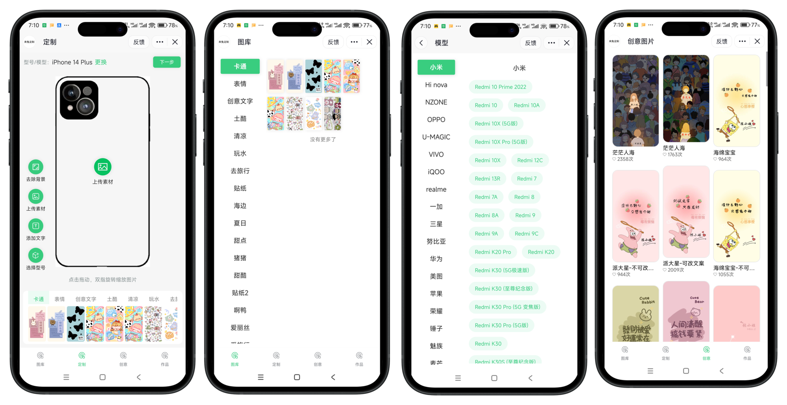

# 介绍

一款基于UNIAPP开发的手机壳DIY小程序（前端完整代码），兼容抖音和微信小程序

> 项目自带Mock接口，启动后小程序可正常运行和使用

## 使用方法

1. 修改`manifest.json`中的`appid`为你的小程序的appid
2. 安装依赖：npm i -D
3. 运行项目：npm run dev:mp-weixin
4. 运行后会编译到项目下的目录：/dist/dev/mp-weixin
5. 使用微信小程序开发者工具打开上述目录

Ps：项目启动的同时会自动运行mock接口

> 项目基于uniapp cli脚手架开发，无需使用Hbuilder

## 新版小程序

小程序：<https://diy.nicen.cn/qr?shop=32106>

普通商户：<https://diy.nicen.cn/trial?as=user>

Saas管理：<https://diy.nicen.cn/trial?as=saas>

> 新版小程序支持多应用，且单个应用支持多商户，支持Saas服务或独立部署。如您有意向或需要定制开发，请联系wx good7341

## H5图形库

DIY.JS 是一款基于原生 Canvas 开发的业务级图形库。

DIY.JS 专注于为商品定制提供强大的图形交互功能，帮助开发者轻松实现商品的个性化设计，适用于
T 恤、手机壳、抱枕等多种商品的定制场景。

DIY.JS 自带许多安装即用的功能，开发者无需从零开始构建，能够快速集成到项目中并投入使用。

Github：<https://github.com/friend-nicen/diy.js>

diyjs文档：<https://diyjs.nicen.cn/docs>

基于diy.js开发的图形编辑器：<https://diy.nicen.cn>

### 商品案例

* DIY手机壳：<https://diy.nicen.cn/?style=1227>
* DIY T恤：<https://diy.nicen.cn/?style=95>
* DIY包包：<https://diy.nicen.cn/?style=89>
...
### 作品展示

* 精美手机壳：<https://diy.nicen.cn/?project=87>
* 傻萌抱枕：<https://diy.nicen.cn/?project=84>
* 时尚T恤：<https://diy.nicen.cn/?project=66>

### 多语言支持

* 英语：<https://diy.nicen.cn/shop/32106/en>
* 韩语：<https://diy.nicen.cn/shop/32106/kn>
* 越南语：<https://diy.nicen.cn/shop/32106/vi>
* 泰国：<https://diy.nicen.cn/shop/32106/th>
* 菲律宾：<https://diy.nicen.cn/shop/32106/tl>
* 印尼语：<https://diy.nicen.cn/shop/32106/id>

# 合作咨询

微信：`good7341`，备注：`DIY小程序`